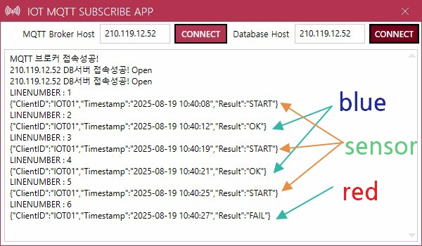

## 미니프로젝트 3

### 컨베이어벨트 제작

- 미니프로젝트 2에서 시뮬레이터로 작업한 생산라인(컨베이어벨트) 제작
- 아두이노 R4 WIFI 1개, 적외선 감지센서 2개, 컬러센서 1개, 컨베이어벨트 1개, L298 모터드라이버 1개, 12V 외부전원 어댑터


#### 아두이노 R4 WIFI
- 아두이노 R3의 단점 개선한 제품
- WIFI 탑재, LED Display 추가, 데이터케이블 USB C타입으로 변경


#### L298 모터드라이버 
- 아두이노 확장보드 - GPIO 핀들 그대로 사용 + 추가 포트(모터연결, 부저, 센서연결부) 구성


### 컬러센서
- TCS3200 아두이노 컬러감지 센서 모듈 GY-31
- RGB 색상을 체크하는데 작게 센싱되는 값이 해당 색상을 의미


- 핀(10개) 단자 설명
    - VCC : 두개 존재. 하나만 사용해도 무방. 3.3V, 5V
    - GND : 두개 GND 연결
    - S0 : D2
    - S1 : D3
    - S2 : D4(!) 문제 발생
    - S3 : D5
    - OUT : D6
    - LED : 연결안함


- 웹캠, AI카메라 장착해서 물체인식, 사진촬영으로 변경가능


### 아두이노 코딩

- 에듀이노 제공 [소스](https://drive.google.com/file/d/1Ynv1qDtvixZE4xDdBCHFRafVptN0Gzxr/view)로 시작

#### 패시브 부저 동작확인
[소스](./conveyor_belt/cb0001.ino)

#### 컨베이어 벨트 모터컨트롤
- 속도(value) 값이 75이하가 되면 모터 동작 안함, 150이상은 벨트 속도가 너무 빠름
- 데이터케이블 사용하지 않을 때 외부전원이 필요. 모터 속도도 안정화

[소스](./conveyor_belt/cb0002.ino)

#### 적외선 감지 센서
- A0 센서에서 감지되면 컨베이어벨트 동작, A1 센서에 감지되면 벨트 멈춤

[소스](./conveyor_belt/cb0003.ino)

https://github.com/user-attachments/assets/55dcde90-ed47-42aa-901a-88bc3b5c7e6b

#### 칼라센서 
- 센싱이 정확하지 않은 문제 내포. 센서가 저렴. 다른 센서와 복합적으로 사용

[소스](./conveyor_belt/cb0004.ino)

https://github.com/user-attachments/assets/2d0c22fa-386c-4d27-bf93-5f36bacd49aa

#### MQTT 통신
- Arduino R4 WIFI에서 통신 가능. RPi나 외부 연결이 불필요
- ArduinoMqttClient는 라이브러리 관리자에서 설치
- 5G는 연결안됨. 2.4G WIFI만 연결

[소스](./conveyor_belt/cb0005.ino)

#### 전체 소스 통합
- 나눠서 작업한 소스 통합작업
- Blue -> OK, RED/Orange -> FAIL
- A0 IRSensor에 물체 감지 -> START

[소스](./conveyor_belt/cb0006.ino)


https://github.com/user-attachments/assets/78f1c2f0-22f2-4e9b-8c8c-6ec47fe813f2

### MES 소스수정

#### MRP 공정모니터링 솔루션 변경
- 컨베이어 시뮬레이터 제거, 컨베이어 벨트 동작으로 변경
- IOT MQTT SUBSCRIBE APP은 기존 그대로 사용!



- 현재 공정모니터링 앱 화면


- MQTT 메시지 중 `START`로 메시지 확인되면

    ```cs
    // MqttMessageReceivedAsync 메서드 내
    else if (data.Result.ToUpper().Equals("FAIL"))
    {
        FailAmount += 1;
        ProductBrush = Brushes.Crimson;
        _prcResult = false;
    }
    else if (data.Result.ToUpper().Equals("START"))
    {
        // HACK: 추가!!
        // MQTT 스레드에서 UI 스레드 분리 동작
        Application.Current.Dispatcher.InvokeAsync(() =>
        {
            // 애니메이션 시작!
            ProductBrush = Brushes.Gray;
            StartHmiRequested?.Invoke();  // 컨베이어벨트 애니메이션 요청(View에서 처리)
        });
    }
    ```

https://github.com/user-attachments/assets/b25e44e1-2a77-4699-82e7-d4c422b9ecde


### 추가 진행
- 컬러센서 센싱 후 부저 동작
    - 성공과 실패에 따라 다른 소리 발생

- 모니터링 앱에 비상정지 버튼 추가, 컨베이어 벨트 비상정지 기능 
    - Arduino MQTT Subscribe 추가
    - 정지 기능 구현
