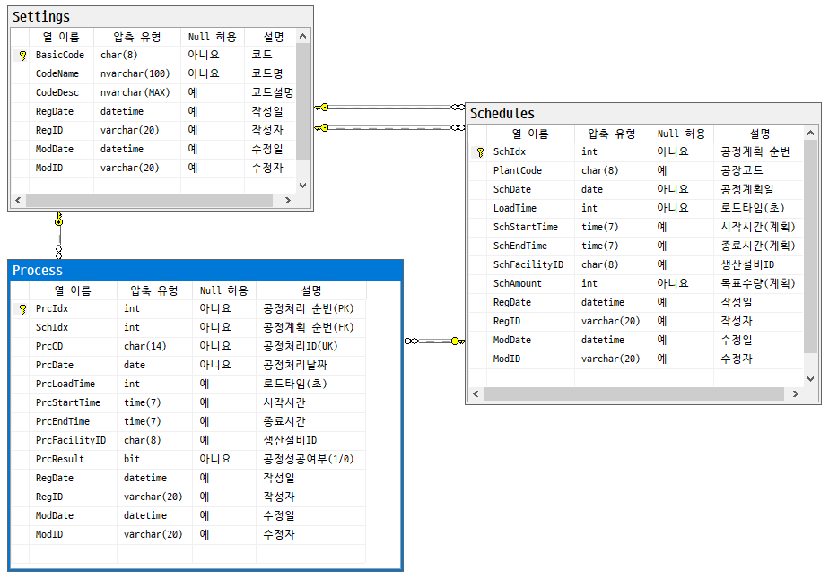

## 개인 IoT 프로젝트

### 포트폴리오 개발

#### MES 공정관리 시뮬레이션
- 용어
    - MES : Manufacturing Execution System 생산실행관리 시스템
        - 생산현장에서 실시간으로 제조/생산 작업 계획, 실행, 추적, 모니터링 하는 시스템
        - 작업 지시, 생산 실적, 품질 관리, 설비 가동 모니터링 등
        - ERP에서 제조/생산에 관련된 데이터 전달받아서 실시간 처리한 뒤 결과를 다시 ERP로 전달
    - MRP : Material Requirements Planning 자재 소요 계획
        - 제품 생산에 필요한 자재 수량과 시기 계산, 자재를 적시에 구매 또는 생산하도록 계획하는 시스템
        - 보통 BOM(Bill Of Material. 제품구조표), 재고 정보, 생산 계획 등을 기반으로 작동
        - MES 포함시켜서도 관리
    - SmartFactory : MES와 관점의 차이
        - MES - 실시간으로 처리하는 시스템
        - SF는 비전, 시각화(실시간). IoT 센서 장비, 클라우드, AI + 시스템

##### 작업 개요

전체 구조도

- IoT 디바이스 - C# 시뮬레이터로 대체, MQTT Publish 병행
- MQTT 시스템 - Mosquitto broker 사용
- MQTT Subscriber : MQTT 데이터 수신 및 DB 저장
- 공정 관리 시스템 : WPF 공정 관리 모니터링 및 계획, 리포트

ERD

##### 양품/불량품 선별용 IoT 센서 장비
- 컬러 센서 : 색상으로 선별
    - 상대적으로 저렴하고 간단한 색상만으로 선별 필요할 때 사용
    - [구매 링크](https://www.devicemart.co.kr/goods/view?no=1066926)
- 로드셀 무게 센서 : 무게로 선별
    - 무게로 선별 필요한 과일, 채소 등에 사용
    - [구매 링크](https://www.devicemart.co.kr/goods/view?no=12146929)
- 적외선 거리 센서 : 물체와 거리 측정
    - 선별을 위한 물건이 제 위치에 있는지 측정 도구
    - [구매 링크](https://www.devicemart.co.kr/goods/view?no=1341808)
- 적외선 감지 센서 : 송신, 수신 센서
    - 라인상 물건이 도착했는지 측정 도구
    - [구매 링크](https://www.devicemart.co.kr/goods/view?no=1310703)
- 적외선 열화상 센서 : 납땜 불량 체크, 열처리 온도 이상 감지
    - [구매 링크](https://www.devicemart.co.kr/goods/view?no=12382843)
- 사운드 센서

#### 파이썬 AI + ASP.NET 연동

### 파이널 프로젝트 관련

#### 주제 선정

#### 주제 발표

#### 장비 구매목록