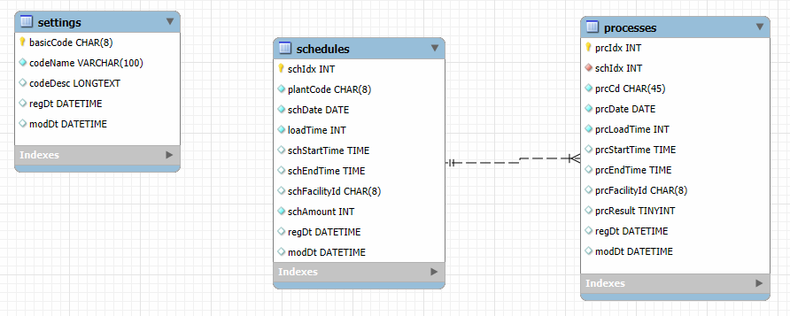

## 미니프로젝트 2

### 포트폴리오 개발

#### MES 공정관리 시뮬레이션
- 용어
    - MES : Manufacturing Execution System 생산실행관리 시스템
        - 생산현장에서 실시간으로 제조/생산 작업 계획, 실행, 추적, 모니터링하는 시스템
        - 작업지시, 생산실적, `품질관리`, `설비가동모니터링` 등
        - ERP(회사의 모든 데이터)에서 제조/생산에 관련된 데이터를 전달받아서 실시간 처리한뒤 결과를 다시 ERP로 전달
    - MRP : Material Requirments Planning 자재 소요 계획
        - 제품 생산에 필요한 자재 수량과 시기를 계산, 자재를 적시에 구매 또는 생산하게 계획하는 시스템
        - 보통 BOM(Bill Of Material, 제품구조표), 재고정보, 생산계획 등을 기반으로 작동
        - MES에 포함시켜서도 관리
    - SmartFactory : MES와 관점의 차이
        - MES는 실시간으로 처리하는 시스템. 소프트웨어
        - SF는 비전, 시각화(실시간). IoT 센서장비, 클라우드, AI + 시스템

##### 작업 개요

전체 구조도

- IoT 디바이스 : C# 시뮬레이터로 대체, MQTT Publish 병행
- MQTT 시스템 : Mosquitto broker 사용
- MQTT Subscriber : MQTT 데이터 수신 및 DB저장
- 공정관리 시스템 : WPF 공정관리 모니티링 및 계획, 리포트

ERD

##### 양품/불량품 선별용 IoT 센서장비
- [컬러센서](https://www.devicemart.co.kr/goods/view?no=1066926) : 색상으로 선별
    - 상대적으로 저렴하고 간단한 색상만으로 선별이 필요할 때 사용
- [로드셀무게센서](https://www.devicemart.co.kr/goods/view?no=12146929) : 무게로 선별
    - 무게로 선별이 필요한 과일, 채소 관련 등에 사용
- [적외선거리센서](https://www.devicemart.co.kr/goods/view?no=1341808) : 물체와 거리 측정
    - 선별을 위한 물건이 제위치에 있는지 측정 도구
- [적외선감지센서](https://www.devicemart.co.kr/goods/view?no=1310703) : 송신, 수신센서
    - 라인상에 물건이 도착했는지 측정 도구
- [적외선열화상센서](https://www.devicemart.co.kr/goods/view?no=12382843) : 납땜불량 체크, 열처리 온도 이상 감지
- [사운드센서](https://www.devicemart.co.kr/goods/view?no=38340) : 모터 진동이상, 소리로 판별할 수 있는 것
- [3D센서](https://www.devicemart.co.kr/goods/view?no=14930970) : 부품 조립상태, 오차, 두께불량
- [비전센서](https://www.devicemart.co.kr/goods/view?no=15548729) : AI접목 카메모듈
    - 긁힘, 오염, 결함, 조립 오류 탐지

- 2019년도 학생 작품 영상 - https://www.youtube.com/watch?v=qo5e_HCUAl8
- 유튜브에서 sorting machine으로 검색

##### 양품/불량품 선별용 모터장비
- [컨베이어벨트]() - 선별을 위한 기반 인프라
- [서보모터]() - 가장 저렴하게 분류가능
- [푸시모터]() - 앞쪽으로 밀어내어서 분류
- [에어실린더]() - 압축공기 힘으로 불량품을 튕겨내어서 분류
- [회전테이블]() - 원형테이블에서 제품을 회전 이동 검사/분류
- [로봇암]() - 아주 섬세하게 분류가능 
- [AGV]() - 먼거리까지 분류, 이동 가능

##### 양품/불량품 선별예
- 음식포장 검사, 볼트 조립 검사, 납땜 공정, 액체 충전 검사, ...

##### 공정관리 ERD
1. MySQL Workbench 
    - miniproject 테이터베이스 생성
    - 테이블 
        - settings - 공통코드 테이블
        - schedules - 공정계획 테이블
        - processes - 처리할 실시간 공정과정 저장 테이블

##### IoT 디바이스 시뮬레이터
- 라즈베리파이, 아두이노 등 사용 디바이스 구성 및 구현
- C# 시뮬레이션으로 동작을 만드는 윈앱 구현

1. Visual Studio 프로젝트 생성

##### MQTT Subscriber
- WPF 과목에서 사용했던 MQTT Subscriber 그대로 사용
- WpfMqttSubApp 프로젝트 가져오기
- SmartHome 작업했던 부분 수정 DB 저장부분 변경

##### WPF 공정관리 앱 개발
- 

#### 파이썬 AI + ASP.NET 연동
- 참조소스
- iot-webapp-2025/ref/ReferencedSolution/ConvertWebApp 
- hungout-with-springboot/003_aicombo/

### 파이널프로젝트 관련

#### 주제 선정

#### 프로젝트 주제 발표

#### 프로젝트 사용 재료선정